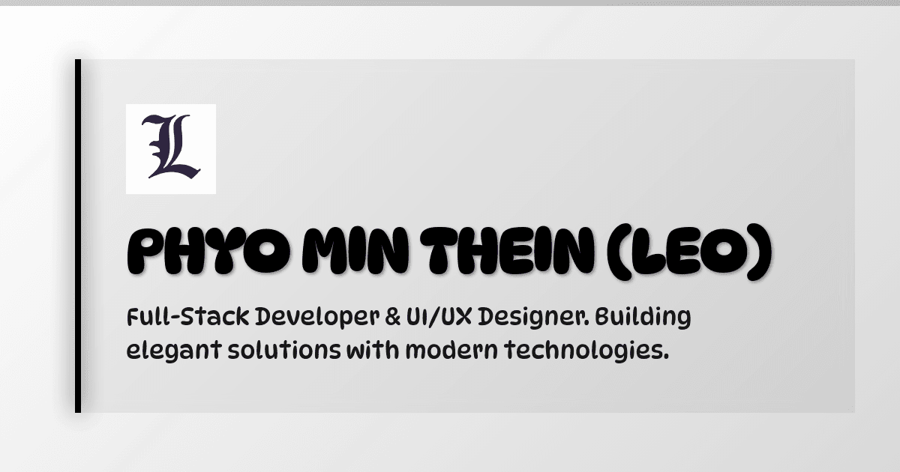

# Next-Generation Developer Portfolio 🚀

A high-performance, ultra-modern developer portfolio website designed with a dark, immersive aesthetic. Built for speed, seamless animations, and absolute administrative control via a fully functional backend dashboard.



## 📌 Key Features

*   **Dark-Themed Aesthetic:** High-quality, glassmorphic UI elements built on a sleek, minimalist zinc/black backdrop. 
*   **Fully Configurable Admin Panel:** No hardcoded data! Securely log into a hidden `/admin` dashboard to seamlessly manage your Projects, Skills, Certificates, Hero text, and Social Links.
*   **Fluid Framer Animations:** Natively utilizes `framer-motion` for complex entering, scrolling, and hover animations, providing a luxury app-like feel.
*   **Full Screen Project Details Mode:** Easily click into any major project to automatically spawn a dedicated `/project/:id` page packed with deeper details, rich media, and tech-stack information.
*   **Firebase Backend:** Real-time data storage, authentication, and image handling completely powered by Firebase Firestore and Authentication.
*   **Advanced SEO Ready:** Pre-configured with rich `OpenGraph`, `Twitter Cards`, `JSON-LD Schema`, and cleanly generated HTML headers for high search-engine indexing scores.

---

## 🛠 Tech Stack

*   **Framework:** [React 18](https://react.dev/) + [Vite](https://vitejs.dev/)
*   **Language:** [TypeScript](https://www.typescriptlang.org/)
*   **Styling:** [Tailwind CSS 3](https://tailwindcss.com/)
*   **Motion & Animation:** [Framer Motion](https://www.framer.com/motion/)
*   **Global State Management:** [Zustand](https://docs.pmnd.rs/zustand/getting-started/introduction)
*   **Icons:** [Lucide React](https://lucide.dev/)
*   **Backend & DB:** [Firebase Firestore & Auth](https://firebase.google.com/)
*   **Routing:** React Router DOM v6

---

## 💻 Running the App Locally

### 1. Prerequisites
You need to have [Node.js](https://nodejs.org/) installed on your machine.
Ensure you have set up a valid Firebase Database and Web App.

### 2. Install Dependencies
Clone the repository and install the standard NPM packages:
```bash
npm install
```

### 3. Environment Variables
Create a standard `.env` file in the root directory of your project. You will need to add your personal Firebase config variables here in order for the application to properly stream data:
```env
VITE_FIREBASE_API_KEY=your_api_key_here
VITE_FIREBASE_AUTH_DOMAIN=your_auth_domain_here
VITE_FIREBASE_PROJECT_ID=your_project_id_here
VITE_FIREBASE_STORAGE_BUCKET=your_storage_bucket_here
VITE_FIREBASE_MESSAGING_SENDER_ID=your_sender_id_here
VITE_FIREBASE_APP_ID=your_app_id_here
```

### 4. Start Development Server
```bash
npm run dev
```
Navigate to `http://localhost:5173`. 

---

## 🔒 Accessing the Admin Panel

The Admin portal is securely hidden from public view. It is responsible for allowing you to edit the text, images, and projects displayed directly on the live portfolio.

1. Navigate to `http://your-website.com/admin`
2. Enter your authorized Firebase User credentials.
3. Manage the content organically through the Dashboard sidebar!

---

## 🚀 Deployment

This project is highly optimized for deployment on hosts like **Vercel** or **Netlify**.

*   Ensure your build command is set to `npm run build`.
*   Ensure the output directory is configured as `dist`.
*   Make sure to securely add your Firebase keys into your host's **Environment Variable Configurator**.
*   (Vercel automatically understands the included `vercel.json` file for routing.)

---
*Architected with ❤️ for modern software engineers.*
